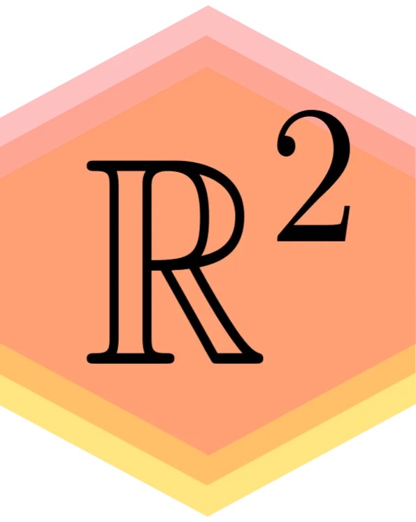

#+title: You're Lost!
#+author: Preston Pan
#+description: You're looking in the wrong place!
#+language: en
#+OPTIONS: broken-links:t

#+attr_html: :width 595 :height 746
#+attr_html: :alt My ret2pop logo
#+caption: Nice! You found my 404 Page!

* Wow!
Is this an easter egg? No, it is not. You're lost, you're on the 404 page, this is obviously either your fault or
the fault of whoever sent you this link. However, you can go back to my real website using the header above,
and you can even finish reading this content.
** What Is This Content?
You know what? I'm actually going to use this page to test if all my CSS on my page is actually working. Yeah.
That's right. This webpage is actually going to make it to /production/, yet it's literally going to be used as a CSS
stylesheet test page as well. Why? I guess I'm quirky.
*** Let's do even more nested headers
Because why not? I don't have anything against them.
**** Aren't Fourth Level Nested Headers Bad Design?
Yes, probably, but you know what, we're just going to run with it.

* Visual Eye-Candy
To start with, let us ask a motivating question:
#+begin_question
Why does this webpage even exist in the way that it does? How come I made this thing? Why?
#+end_question
Which will be answered very shortly I'm sure!

Do you want to see some cool code blocks, and other such visual elements? Well you've discovered just the webpage!
#+begin_src python :results output :exports both
import math

print("hello, world!")
print("Yeah, we're going to write an amazing 404 page/504 page")
print("Okay yeah well you know")

x = 5
if x == 5:
    print("wow code is executing")
else:
    print("I have a fourth grade education")

print(math.pi)
#+end_src

#+RESULTS:
: hello, world!
: Yeah, we're going to write an amazing 404 page/504 page
: Okay yeah well you know
: wow code is executing
: 3.141592653589793

You know I can also use multiple languages:
#+begin_src nix
{
  my_attrset = {
    deeply_nested_attrset = {
      this_is_too_nested = {
        wow_this_is_nested = {
          some_string = "asdf";
          some_int = 4;
          some_lambda = x: y: x + y;
          some_nested_also = {
            very_nested = {
              aaaaaaaaaaaaaaaaaaaaaaaaaaaaaaaaaaaaaaaaaaa = {
                hello = "hello";
              };
            };
          };
        };
      };
    };
  };
}
#+end_src
Or would you like to have a mix of very long and quite short latex blocks? I can do inline latex too: $x = 5$.
\begin{align}
x = 5 \\
y = 2 \\
(AD^{2} + BD + C)(f)(x) = sin(\omega t) \\
1 + 2 + 3 + 4 + \ldots n = \frac{1 + 2 + 3 + 4 + 5 + 6 + 7 + 1 + 2 + 3 + 4 + 5 + 6 + 7}{3}
\end{align}
Also you know what? I have some other ~display: block~ elements as well:
#+begin_quote
If I had to eat cheese, I would not be me. -- Preston Pan
#+end_quote
You know what, I could have lorum ipsum'd all of this, but instead I have written entertaining content that is almost as meaningless, you're welcome.
#+begin_example
lol, you really think this example means anything? Well, luckily for you, it does not.
#+end_example
I can also write some nice theorems and proofs:
#+begin_theorem
If $X$ is a locally compact Hausdorff space and I am your dad, then $Y$ is your grandmother.
#+end_theorem

#+begin_proof
We will use proof by contradiction. Suppose $Y$ was not your grandmother, then for all $x \in X$ there exists an open neighborhood $U$ such that $\overline{U}$ is compact,
yet because I am your dad, I must live in every compact neighborhood that you live in, so really if you think of me as a net I am everywhere all at
once. So the only way I could not do that is if your grandmother was my mom and I had to take care of her in her old age. Contradiction!
#+end_proof
These are really all important specialised visual elements that I use in order to style my website. Though there are also some other notable org-mode
related ones:
* TODO Wow, Look
It's a todo tag, and I can also create some other ones like this
** DONE This One is Done
Okay yeah I mean title.
** More Pill Styles :tagged:
This one is tagged.
** More Tags :thisisaverylongunbrokenstringtotestoverflowbehaviorandseewhetherthelayoutexplodesonsmallscreens:
Okay, this is reading less like a quirky 404 page now and more like i'm just testing random elements. If you've made it this far, I'm genuinely
surprised. You can see how I'm trying to break my website in real time.

Hopefully this smoke test will have caught something in its lifetime, or else I wasted a couple hours of my life for nothing. Are /you/ lost, or am /I/
lost?

Anyways. I really like inline footnotes. [fn:: Maybe I should use these elements for something useful instead of just for memes, eh?]
* TODO [#A] Extremely Important Heading :urgent:work:
SCHEDULED: <2026-03-15 Sun>
DEADLINE: <2026-03-20 Fri>
CLOSED: [2026-03-15 Sun 18:00]
* Line Breaks
This line ends here.\\
This should appear on the next line.
* Tables
In org mode, you can even write tables:
| Album          | Author        | Good | Description                                                                                                                                                 |
|----------------+---------------+------+-------------------------------------------------------------------------------------------------------------------------------------------------------------|
| Animals        | TTNG          | Y    | A really great quintessential album and deeply influential in math rock.                                                                                    |
| Ultra Ego      | Feed Me Jack  | Y    | A jazzy album that is also sort of indie rock, with a bit of math. Incredible artistic vision.                                                              |
| Somewhere City | Origami Angel | Y    | A feel good album that does emo rock in its essence and actually does it in an innovative way.                                                              |
| Technicolor    | Covet         | Y    | Mathy guitar with Yvette Young, a great guitarist and with amazing feel good vibes (you'd think it wouldn't be possible with mostly instrumental but it is) |
These are all great albums. See? If you've discovered something here, you haven't wasted your time!
* Other things
- I can add list elements like this.
- This seems to be a great way to test my website.
- I am making sure to test things.
* Ordered Lists
1. It should be an ordered list.
2. I should be able to parse this.
3. I am really sure that this is nonsense.
* Checkboxes
- [ ] Check number one
  - [ ] Check number two (nested)
- [X] Check number three
* Links and Inline Markup
Here is an [[https://ret2pop.net][external link]], a [[./index.html][relative link]], *bold*, /italic/, _underline_, +strike+, =verbatim=, and ~code~.
* Description List
- Org :: Powerful plaintext editing
- CSS :: The worst possible system anyone could have designed
- Nix :: An amazing language that everyone thinks is bad[fn:3]
[fn:3] This is a story for another day, but it's not that bad. The only problem is the lack of static typing.
* Some Footnotes
Here is a sentence with a footnote.[fn:2]
[fn:2] This is a footnote for testing styling.
* More Blocks
-----
Here is my very great poem:
#+begin_verse
The margins drift
The padding lies
The mobile breakpoint
Devours my eyes

We all love CSS
It's clearly so blessed
We must all kneel
at its behest
#+end_verse
Now you wish that you read this! Also I can do magic tricks, like centering text!
#+begin_center
Centered text test. I don't even use this in my website, though.
#+end_center
* Overflow Tests
Source blocks!
#+begin_src text
this-is-a-very-long-unbroken-string-to-test-overflow-behavior-and-see-whether-the-layout-explodes-on-small-screens
#+end_src
Examples!
#+begin_example
this-is-a-very-long-unbroken-string-to-test-overflow-behavior-and-see-whether-the-layout-explodes-on-small-screens
#+end_example
Quotations!
#+begin_quote
this-is-a-very-long-unbroken-string-to-test-overflow-behavior-and-see-whether-the-layout-explodes-on-small-screens
#+end_quote
Verses!
#+begin_verse
this-is-a-very-long-unbroken-string-to-test-overflow-behavior-and-see-whether-the-layout-explodes-on-small-screens
#+end_verse
There's more where that came from! ~this-is-a-very-long-unbroken-string-to-test-overflow-behavior-and-see-whether-the-layout-explodes-on-small-screens~, 
=this-is-a-very-long-unbroken-string-to-test-overflow-behavior-and-see-whether-the-layout-explodes-on-small-screens=.

#+caption: Wide table test
| Name | Notes                                                                                                                                    |
|------+------------------------------------------------------------------------------------------------------------------------------------------|
| A    | This is a very long table cell intended to test wrapping behavior on narrow screens and ensure the table does not become visually cursed |
| B    | Short                                                                                                                                    |

| Name A           | Name B                                                         | Name C                                 | Name D                     | Name E                                     | Name F | Name G | Name H | Name I | Name J | Name K | Name L  | Name M |
|------------------+----------------------------------------------------------------+----------------------------------------+----------------------------+--------------------------------------------+--------+--------+--------+--------+--------+--------+---------+--------|
| lol this is text | hello world my name is preston pan, and this is a long message | holy shit this table is extremely long | Please stop this is cursed | aaaaaaaaaaaaaaaaaaaaaaaaaaaaaaaaaaaaaaaaaa | what   | is     | going  | on     | with   | my     | website | Please |
* Timestamps
- Active: <2026-03-15 Sun>
- Inactive: [2026-03-15 Sun]
- Range: <2026-03-15 Sun>--<2026-03-16 Mon>
- Diary-style: <2026-03-15 Sun +1w>
:LOGBOOK:
- Note taken on [2026-03-15 Sun]
:END:
* Conclusion
I've tested literally every single possible element on my website that I could think of. What a load of eye candy and random useless information!
Anyways, if you like what you're looking at, you should probably see [[https://ret2pop.net][my main website]].
